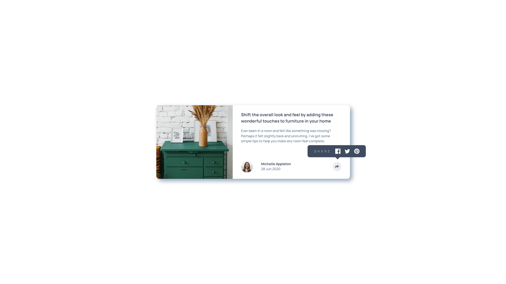

# Frontend Mentor - Article preview component solution

This is a solution to the [Article preview component challenge on Frontend Mentor](https://www.frontendmentor.io/challenges/article-preview-component-dYBN_pYFT). Frontend Mentor challenges help you improve your coding skills by building realistic projects. 

## Table of contents

- [Overview](#overview)
  - [The challenge](#the-challenge)
  - [Screenshot](#screenshot)
  - [Links](#links)
- [My process](#my-process)
  - [Built with](#built-with)
  - [What I learned](#what-i-learned)
  - [Continued development](#continued-development)
  - [Useful resources](#useful-resources)
- [Author](#author)
- [Acknowledgments](#acknowledgments)

## Overview

### The challenge

Users should be able to:

- View the optimal layout for the component depending on their device's screen size
- See the social media share links when they click the share icon

### Screenshot

### Links

- Solution URL: [Add solution URL here](https://your-solution-url.com)
- Live Site URL: (https://sclingan.github.io/article-preview)

## My process

### Built with

- Semantic HTML5 markup
- CSS custom properties
- Flexbox
- CSS Grid
- Mobile-first workflow
- [React](https://reactjs.org/) - JS library

### What I learned

I learned about using CSS animations, still need to work on a better understanding
of animation timing. I also learned about using a tooltip, using ::before and 
::after for the pointer.

### Continued development

I would like to return to this project and improve on animations and 
use a backend API to load different posts.

### Useful resources

- (https://developer.mozilla.org/en-US/) - A great resource for all things web dev!
- (https://validator.w3.org/) - Test your website!!

## Author

- Frontend Mentor - [@sclingan](https://www.frontendmentor.io/profile/sclingan)

## Acknowledgments

Thank you to Frontend Mentor for a great challenge.
